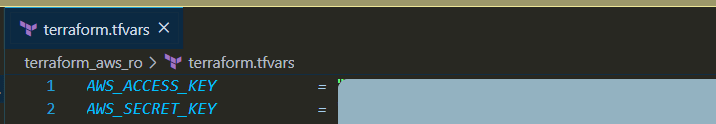

# Jenkins AWS Spot

## Prerrequisitos

- Tener instalado terraform en la versión **0.12** o superior
- Usuario en AWS con tipo de acceso **Programmatic Access** y permisos de habilitados 


## Configuración inicial

-	Generación SSH
	- Generar en el directorio *terraform_aws_ro*  key pair RSA , ejecutar ```sh  ssh-keygen -f aws_key ```
- Configuración terraform.tfvars
	- Crear el archivo terraform_aws_ro/terraform.tfvar. En este fichero se deben incluir las variables 
        - ```AWS_ACCESS_KEY: key de usuario creado en aws (ver prerrequisitos)```
        - ```AWS_SECRET_KEY: secret de usuario creado en aws (ver prerrequisitos)```
		- ```BLOCK_DURATION_MINUTES: tiempo de la instancia spot ```
		- ```INSTANCE_NAME: nombre de la instancia ```
		- 


> **Nota**: en este archivo se deben incluir las variables que se desean mantener en secreto o que se deseen > sobrescribir del archivo vars.tf


##  Creación de infraestructura

-   Para realizar el **despliegue** de la infraestructura, en el directorio *terraform_aws_ro* se debe ejecutar el comando  ```terraform apply```

##   Destrucción de Infraestructura
-   Para realizar el **destrucción** de la infraestructura, en el directorio *terraform_aws_ro* se debe ejecutar el comando  ```terraform destroy```
